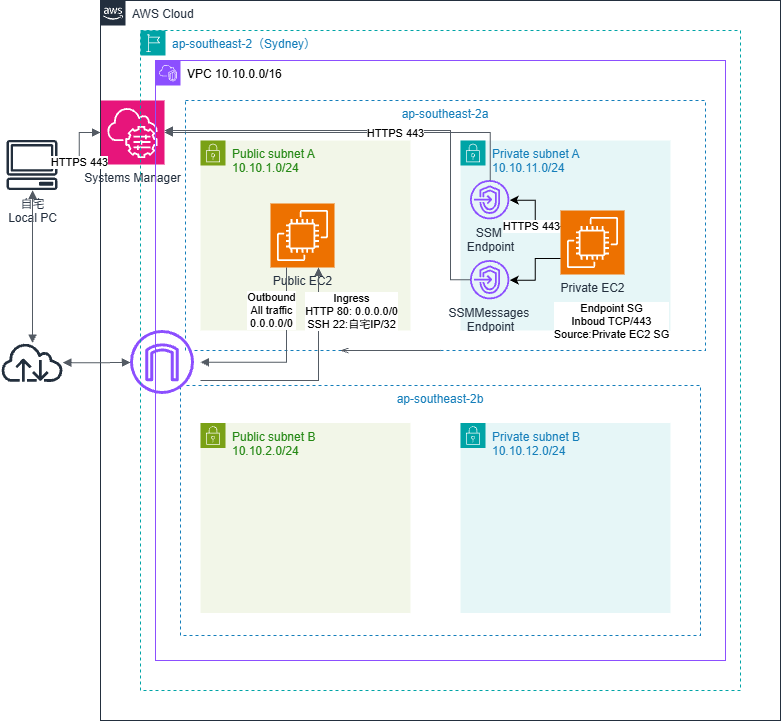

# Terraform AWS VPC Basic

## 1. 目的
Terraformを利用して、AWS上にVPC、Subnet、Route Table、Security Group、EC2を構成し、
AWSネットワークとInfrastructure as Codeの基本を学習する。

また、Private EC2への管理接続について、
踏み台サーバ経由のSSH接続からAWS Systems Manager Session Managerへ移行し、
開放せずに管理できる環境を構築する。

---

Public / Private Subnetの役割や通信経路を理解し、
TerraformによってAWS環境を再現できることを目的とする。

## 2. 構成概要

- Region: ap-southeast-2
- VPC: 10.10.0.0/16
- Public Subnet A: 10.10.1.0/24
- Public Subnet B: 10.10.2.0/24
- Private Subnet A: 10.10.11.0/24
- Private Subnet B: 10.10.12.0/24
- Public EC2: Public Subnet A
- Private EC2: Private Subnet A
- SSM Interface VPC Endpoint: Private Subnet A
- SSMMessages Interface VPC Endpoint: Private Subnet A

Public / Private Subnetは2AZ分作成しているが、
現在EC2とVPC Endpointを配置しているのはAZ-aのみ。

## 3. ネットワーク設計

### VPC / Subnet

| 種別 | CIDR | Availability Zone | 用途 |
|---|---|---|---|
| VPC | 10.10.0.0/16 | - | 学習用VPC |
| Public Subnet A | 10.10.1.0/24 | ap-southeast-2a | Public EC2配置用 |
| Public Subnet B | 10.10.2.0/24 | ap-southeast-2b | 将来の冗長構成用 |
| Private Subnet A | 10.10.11.0/24 | ap-southeast-2a | Private EC2 / VPC Endpoint配置用 |
| Private Subnet B | 10.10.12.0/24 | ap-southeast-2b | 将来の冗長構成用 |

### Route Table

| Route Table | Destination | Target | 用途 |
|---|---|---|---|
| Public | 10.10.0.0/16 | local | VPC内通信 |
| Public | 0.0.0.0/0 | Internet Gateway | Internet通信 |
| Private | 10.10.0.0/16 | local | VPC内通信 |

Private Route TableにはInternet向けの`0.0.0.0/0` Routeを設定していないため、
Private EC2からInternetへ直接通信することはできない。

## 4. セキュリティ設計

### Public EC2 Security Group
```
Ingress:
HTTP TCP/80 0.0.0.0/0
SSH TCP/22 自宅のグローバルIP/32
```
```
Egress:
All traffic 0.0.0.0/0
```

### Private EC2 Security Group
```
Ingress:
Private EC2へのSSH Ingressは設定しない。
```
当初はPublic EC2を踏み台としてTCP/22を許可していたが、
Session Managerによる接続に変更。
接続を確認後、削除した。

```
Egress:
All traffic 0.0.0.0/0
```
※ Egressを許可していてもRoute TableにInternetへの経路がないため、
Private EC2がInternetへ通信できるわけではない。

### SSM Endpoint Security Group
```
Ingress:
HTTPS TCP/443
Source: Private EC2 Security Group
```
Private EC2からVPC EndpointへのHTTPS通信のみ許可する。

## 5. Systems Manager構成
EC2にIAM Roleを付与し、
AWS管理ポリシー`AmazonSSMManagedInstanceCore `をアタッチする。

Private EC2はInternet経由ではSystems Managerへ接続できないため、
以下のInterface VPC Endpointを作成した。
```
com.amazonaws.ap-southeast-2.ssm
com.amazonaws.ap-southeast-2.ssmmessages
```

VPC EndpointではPrivate DNSを有効化している。

```hcl
private_dns_enabled = true
```

VPC側でもDNSを有効化する。

```hcl
enable_dns_support = true
enable_dns_hostnames = true
```

これにより、

```
ssm.ap-southeast-2.amazonaws.com
```

などの通常のAWSサービス名が、
VPC EndpointのPrivate IPへ名前解決される。

## 6. Terraformで管理しているリソース
```
VPC
Subnet
Internet Gateway
Route Table
Route Table Association
Security Group
Security Group Rule
EC2
IAM Role
IAM Instance Profile
IAM Policy Attachment
SSM Interface VPC Endpoint
SSMMessages Interface VPC Endpoint
```

AMIはSystems Manager Parameter StoreからAmazon Linux 2023の最新のAMI IDを取得する。

## 7. 接続方法

### Public EC2
SSHで接続可能

```
Local PC
↓ SSH
Public EC2
```

`terraform output`からPublic IPを取得する。

```bash
PUBLIC_IP=$(terraform output -raw public_ec2_public_ip)
```

Public EC2へSSH接続する。

```bash
ssh -i ~/.ssh/cloud-study-key.pem ec2-user@"$PUBLIC_IP"
```
### Private EC2
AWS Systems Manager Session Managerを使用する。

```Bash
aws ssm start-session \
--target "$PRIVATE_INSTANCE_ID"
```

接続後、以下コマンドを実行。

```Bash
whoami
hostname
ip -br addr
```

確認結果

```
User: ssm-user
Public IP: なし
Private IP:10.10.11.x
```

接続経路
```
Local PC
↓
AWS Systems Manager
↓
SSM / SSMMessages VPC Endpoint
↓
Private EC2
```

Public EC2を踏み台として、Private EC2へSSH接続する必要がなくなり、
ポート22を解放する必要がないためよりセキュアな通信が可能。


## 8. 動作確認
### Terraform
以下を実行し、Terraform Configurationに問題がないことを確認した。

```bash
terraform fmt
terraform validate
terraform plan
```
`terraform plan`では意図しないResourceの変更・削除が
発生しないことを確認してから`terraform apply`を実行した。

### Public EC2
User Dataによって以下が自動実行されていることを確認した。

- Apache HTTP Serverのインストール
- index.htmlの作成
- httpdの起動
- OS起動時のhttpdの自動起動設定

以下のコマンドで確認した。
```bash
sudo cloud-init status
systemctl status httpd --no-pager
systemctl is-enabled httpd
sudo ss -lntp | grep ':80'
cat /var/www/html/index.html
curl -I http://127.0.0.1
```

### Private EC2
- SSM Managed Node確認
```Bash
aws ssm describe-instance-information \
  --query 'InstanceInformationList[].{InstanceId:InstanceId,PingStatus:PingStatus}' \
  --output table
```

Public EC2 / Private EC2の両方が以下になることを確認。
```
PingStatus: Online
```

- Private DNS確認
Private EC2から:
```Bash
getent ahostsv4 ssm.ap-southeast-2.amazonaws.com
getent ahostsv4 ssmmessages.ap-southeast-2.amazonaws.com
```

VPC EndpointのPrivate IPへ名前解決されることを確認。
- Internet接続確認
```
curl -I --connect-timeout 5 https://example.com
```

Private EC2からInternetへは接続できないことを確認。

## 9. トラブルシューティング

### cloud-init statusでPermission denied
一般ユーザーで以下を実行したところ、
cloud-initのConfiguration Fileを読み取れず、Permission deniedとなった。
```bash
cloud-init status
```
権限不足のため、
`sudo`を付けて実行することで確認できた。
```bash
sudo cloud-init status
```

### EC2停止後にterraform planでPublic EC2の再作成が表示された
Public EC2の課金を止めるため、Public EC2を停止。
Public EC2を停止した状態で`terraform plan`を実行したところ、
Public EC2のReplacementが表示された。

EC2停止によって自動割り当て Public IPが外れ、
Terraform Configurationとの差分として検出されたためだった。

Public EC2を再起動してから、`terraform plan`を実行すると、
不要なReplacementは表示されなくなった。

### ProxyJumpでPrivate EC2へ接続できない
`ssh -J`を使用したところ、
踏み台となるPublic EC2で秘密鍵の認証に失敗した。

ProxyCommandでPublic EC2側にも使用する秘密鍵を明示することで接続することができた。
```bash
ssh \
  -i ~/.ssh/cloud-study-key.pem \
  -o ProxyCommand="ssh -i ~/.ssh/cloud-study-key.pem -W %h:%p ec2-user@$PUBLIC_IP" \
  ec2-user@"$PRIVATE_IP"
```

## 10. 学んだこと
- Terraformの variable、data、resource、output の役割
- TerraformによるVPC / Subnet / Route Table / Security Group / EC2の構築
- Terraform Resource間の参照による依存関係
- User Dataとcloud-initを利用したEC2初期設定
- Public SubnetとPrivate Subnetの通信経路の違い
- Security Groupを送信元として使用するアクセス制御
- Public EC2を踏み台としたPrivate EC2へのSSH接続
- LinuxのRouting TableとAWS VPC Route Tableの違い
- terraform plan で意図しない変更や削除を確認する重要性
- AWS CLIを利用した実環境の確認
- Terraformのplanで意図した変更を確認してからapplyする重要性
- validate成功だけではAWS上で正常に構築できるとは限らない
- Terraform StateとAWS実環境には差分が発生することがある
- Security Groupは通信の許可を行うが通信経路自体は作らない
- Interface VPC EndpointにはSubnet内のPrivate IPを持つENIが作成される
- Private DNSを利用するとAWSサービス名をVPC Endpointへ名前解決できる
- SSM Agentが起動していてもネットワーク経路がなければSystems Managerへ登録できない
- ログではERRORだけでなく caused by や timeout など原因部分まで確認する
- Session Managerを利用することでPrivate EC2へのSSH Ingressを削除できる
- 踏み台サーバーを使用せずPrivate EC2を管理できる

## 11. 構成図

