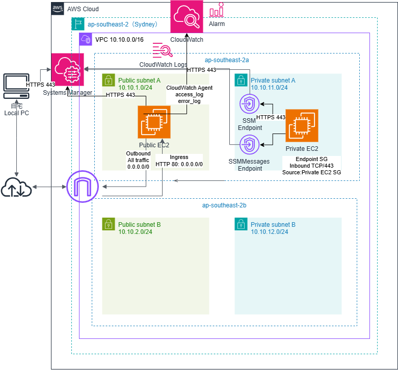

# Terraform AWS VPC Basic

## 1. 目的
Terraformを利用して、AWS上にVPC、Subnet、Route Table、Security Group、EC2を構成し、
AWSネットワークとInfrastructure as Codeの基本を学習する。

また、Private EC2への管理接続について、
踏み台サーバ経由のSSH接続からAWS Systems Manager Session Managerへ移行し、
開放せずに管理できる環境を構築する。

---

Public / Private Subnetの役割や通信経路を理解し、
TerraformによってAWS環境を再現できることを目的とする。

## 2. 構成概要

- Region: ap-southeast-2
- VPC: 10.10.0.0/16
- Public Subnet A: 10.10.1.0/24
- Public Subnet B: 10.10.2.0/24
- Private Subnet A: 10.10.11.0/24
- Private Subnet B: 10.10.12.0/24
- Public EC2: Public Subnet A
- Private EC2: Private Subnet A
- SSM Interface VPC Endpoint: Private Subnet A（任意作成）
- SSMMessages Interface VPC Endpoint: Private Subnet A（任意作成）

SSM用Interface VPC Endpointは、
Private EC2からInternetを経由せずSession Managerへ接続する検証のために構築した。

常時起動すると費用が発生するため、
Terraform変数 `enable_ssm_endpoints` によって作成有無を切り替えられる構成としている。

デフォルトでは作成しない。

```hcl
variable "enable_ssm_endpoints" {
  type    = bool
  default = false
}
```

Public / Private Subnetは2AZ分作成しているが、
EC2は現在AZ-aに配置している。VPC Endpointを有効化する場合もPrivate Subnet Aに作成する。

## 3. ネットワーク設計

### VPC / Subnet

| 種別 | CIDR | Availability Zone | 用途 |
|---|---|---|---|
| VPC | 10.10.0.0/16 | - | 学習用VPC |
| Public Subnet A | 10.10.1.0/24 | ap-southeast-2a | Public EC2配置用 |
| Public Subnet B | 10.10.2.0/24 | ap-southeast-2b | 将来の冗長構成用 |
| Private Subnet A | 10.10.11.0/24 | ap-southeast-2a | Private EC2 / VPC Endpoint配置用 |
| Private Subnet B | 10.10.12.0/24 | ap-southeast-2b | 将来の冗長構成用 |

### Route Table

| Route Table | Destination | Target | 用途 |
|---|---|---|---|
| Public | 10.10.0.0/16 | local | VPC内通信 |
| Public | 0.0.0.0/0 | Internet Gateway | Internet通信 |
| Private | 10.10.0.0/16 | local | VPC内通信 |

Private Route TableにはInternet向けの`0.0.0.0/0` Routeを設定していないため、
Private EC2からInternetへ直接通信することはできない。

## 4. セキュリティ設計

### Public EC2 Security Group
```
Ingress:
HTTP TCP/80 0.0.0.0/0
```
```
Egress:
All traffic 0.0.0.0/0
```
当初は管理接続用として、自宅のグローバルIPからTCP/22を許可していた。
Session Managerによる管理接続を確認したため、
最終構成ではSSH用Ingressを削除した。
これにより、EC2管理のためにSSHポートをInternetへ公開する必要がない構成とした。

### Private EC2 Security Group
```
Ingress:
Private EC2へのSSH Ingressは設定しない。
```
当初はPublic EC2を踏み台としてTCP/22を許可していたが、
Session Managerによる接続に変更。
接続を確認後、削除した。

```
Egress:
All traffic 0.0.0.0/0
```
※ Egressを許可していてもRoute TableにInternetへの経路がないため、
Private EC2がInternetへ通信できるわけではない。

### SSM Endpoint Security Group
```
Ingress:
HTTPS TCP/443
Source: Private EC2 Security Group
```
Private EC2からVPC EndpointへのHTTPS通信のみ許可する。

## 5. Systems Manager構成
EC2にIAM Roleを付与し、
AWS管理ポリシー `AmazonSSMManagedInstanceCore` をアタッチする。

Public EC2はInternet Gatewayを経由してAWS Systems Managerへ接続する。

Private EC2にはInternet向けRouteを設定していないため、
Internetを経由してSystems Managerへ接続することはできない。

そのため、Private EC2のSession Manager接続を検証する際には以下のInterface VPC Endpointを使用する。
```
com.amazonaws.ap-southeast-2.ssm
com.amazonaws.ap-southeast-2.ssmmessages
```

VPC EndpointではPrivate DNSを有効化している。

```hcl
private_dns_enabled = true
```

VPC側でもDNSを有効化する。

```hcl
enable_dns_support = true
enable_dns_hostnames = true
```

これにより通常のAWSサービス名が、
VPC EndpointのPrivate IPへ名前解決される。
```
ssm.ap-southeast-2.amazonaws.com
```

VPC Endpointは学習・検証時のみ作成できるよう、
Terraform変数 enable_ssm_endpoints でON/OFFを切り替える。
コスト削減のためデフォルトでは無効としている。

## 6. Terraformで管理しているリソース
```
VPC
Subnet
Internet Gateway
Route Table
Route Table Association
Security Group
Security Group Rule
EC2
IAM Role
IAM Instance Profile
IAM Policy Attachment
SSM Interface VPC Endpoint（任意作成）
SSMMessages Interface VPC Endpoint（任意作成）
CloudWatch Log Group
CloudWatch Metric Alarm
CloudWatch Log Metric Filter
```

AMIはSystems Manager Parameter StoreからAmazon Linux 2023の最新のAMI IDを取得する。
既存EC2についてはParameter Store上の最新AMI更新によって
意図しないEC2 Replacementが発生しないよう、以下を設定している。
```hcl
lifecycle {
  ignore_changes = [ami]
}
```
新規EC2作成時にはParameter Storeから取得したAMIを使用し、
既存EC2についてはAMI差分をTerraformによる自動置換対象としない。
CloudWatch Agentの設定ファイルは以下に保存している。
```
config/cloudwatch-agent.json
```

現時点ではCloudWatch Agentのインストール・設定配布は手動で実施している。
今後、SSMやCI/CDなどによる自動化を学習する予定。

## 7. 接続方法

### Public EC2

AWS Systems Manager Session Managerを使用する。

```bash
PUBLIC_INSTANCE_ID=$(terraform output -raw public_ec2_instance_id)

aws ssm start-session \
  --target "$PUBLIC_INSTANCE_ID"
```

最終構成ではPublic EC2のSecurity GroupからTCP/22のIngressを削除している。

Public EC2はInternet Gatewayを経由してSystems Managerのサービスエンドポイントへ通信する。

### Private EC2
Private EC2でSession Manager接続を利用する場合は、
SSM / SSMMessages Interface VPC Endpointを有効化する。

```Bash
PRIVATE_INSTANCE_ID=$(terraform output -raw private_ec2_instance_id)

aws ssm start-session \
  --target "$PRIVATE_INSTANCE_ID"
```

接続経路
```
Local PC
    ↓
AWS Systems Manager
    ↓
SSM / SSMMessages VPC Endpoint
    ↓
Private EC2
```

Private EC2にはInternetへのDefault Routeを設定していない。
そのため、VPC Endpointを無効化している状態では
Private EC2からSystems Managerへ接続できない。
VPC Endpointを利用することで、
Internetや踏み台EC2を経由せずPrivate EC2を管理できることを確認した。


## 8. 動作確認
### Terraform
以下を実行し、Terraform Configurationに問題がないことを確認した。

```bash
terraform fmt
terraform validate
terraform plan
```
`terraform plan`では意図しないResourceの変更・削除が
発生しないことを確認してから`terraform apply`を実行した。

### Public EC2
User Dataによって以下が自動実行されていることを確認した。

- Apache HTTP Serverのインストール
- index.htmlの作成
- httpdの起動
- OS起動時のhttpdの自動起動設定

以下のコマンドで確認した。
```bash
sudo cloud-init status
systemctl status httpd --no-pager
systemctl is-enabled httpd
sudo ss -lntp | grep ':80'
cat /var/www/html/index.html
curl -I http://127.0.0.1
```

### Private EC2
- SSM Managed Node確認
```Bash
aws ssm describe-instance-information \
  --query 'InstanceInformationList[].{InstanceId:InstanceId,PingStatus:PingStatus}' \
  --output table
```

Public EC2 / Private EC2の両方が以下になることを確認。
```
PingStatus: Online
```

- Private DNS確認
Private EC2から:
```Bash
getent ahostsv4 ssm.ap-southeast-2.amazonaws.com
getent ahostsv4 ssmmessages.ap-southeast-2.amazonaws.com
```

VPC EndpointのPrivate IPへ名前解決されることを確認。
- Internet接続確認
```
curl -I --connect-timeout 5 https://example.com
```

Private EC2からInternetへは接続できないことを確認。

### CloudWatch

Public EC2の`CPUUtilization`をCloudWatch Metricsで確認した。

```bash
aws cloudwatch get-metric-statistics \
  --namespace AWS/EC2 \
  --metric-name CPUUtilization \
  --dimensions Name=InstanceId,Value="$PUBLIC_INSTANCE_ID" \
  --statistics Average \
  --period 300 \
  --start-time "$START_TIME" \
  --end-time "$END_TIME"
```
TerraformでPublic EC2のCPU使用率を監視するCloudWatch Alarmを作成した。

監視条件:
- Metric: CPUUtilization
- Statistic: Average
- Period: 300秒
- Threshold: 5%
- Comparison: GreaterThanThreshold
- Evaluation Periods: 1

学習用としてThresholdを5%に設定し、
Public EC2へ意図的にCPU負荷を発生させてAlarmの動作を確認した。

```
通常時
CPU 約0.3〜0.4%
→ Alarm: OK

CPU負荷発生
5分平均CPU > 5%
→ Alarm: ALARM

負荷停止
5分平均CPU < 5%
→ Alarm: OK
```
CloudWatch AlarmはリアルタイムのCPU使用率そのものを見るのではなく、
設定したPeriod・Statistic・Thresholdに基づいてMetricを評価する。
EC2上で現在のCPU使用率やProcessを確認する場合はtopなどを使用する。

### CloudWatch Logs

Public EC2上のApacheログをCloudWatch Logsへ転送するため、
Amazon CloudWatch Agentを導入した。

IAM Roleには以下のAWS管理ポリシーを追加した。

```
CloudWatchAgentServerPolicy
```

CloudWatch Agentでは以下のログを収集する。
| Local File | CloudWatch Log Group |
|---|---|
| /var/log/httpd/access_log	| /terraform-study/httpd/access |
| /var/log/httpd/error_log	| /terraform-study/httpd/error |

Log GroupのRetentionは7日としている。
CloudWatch Agent設定は以下に保存している。

```
config/cloudwatch-agent.json
```

ApacheへHTTPリクエストを送り、
ローカルログとCloudWatch Logsの両方に記録されることを確認した。

```Bash
curl http://localhost
```
CloudWatch Logs側では以下のように確認した。
```Bash
aws logs tail \
"/terraform-study/httpd/access" \
--since 1h
```
また、404を意図的に発生させ、
Logを検索できることを確認した。
```Bash
aws logs filter-log-events \
--log-group-name "/terraform-study/httpd/access" \
--filter-pattern '404'
```

### Metric Filter / Custom Metric
Apacheの error_log から特定エラーを検出するため、
CloudWatch Logs Metric Filterを作成した。
今回の学習ではApacheの以下のMessage IDを対象とした。
```
AH01264
```

これは、CGI Scriptが存在しない場合などに出力される
`script not found or unable to stat`
というApache内部エラーメッセージの識別IDである。

Metric Filter:
```
Log Group:
/terraform-study/httpd/error

Filter Pattern:
AH01264
```

一致したLog Eventを以下のCustom Metricへ変換する。
```
Namespace: TerraformStudy/Httpd
Metric:    HttpdErrorCount
Value:     1
```

存在しないCGIへアクセスし、意図的にエラーを発生させた。
```Bash
curl -i http://localhost/cgi-bin/cloudwatch-alarm-test.cgi
```

その結果、
```
Apache Error
↓
/var/log/httpd/error_log
↓
CloudWatch Agent
↓
CloudWatch Logs
↓
Metric Filter
↓
HttpdErrorCount
```
という一連の流れを確認した。

### Apache Error Alarm
Custom Metric `HttpdErrorCount`を監視するCloudWatch AlarmをTerraformで作成した。

監視条件:
```
Metric: HttpdErrorCount
Namespace: TerraformStudy/Httpd
Statistic: Sum
Period: 60秒
Threshold: 1
Comparison: GreaterThanOrEqualToThreshold
Evaluation Periods: 1
```

学習用のためAlarm Actionは無効としている。
```hcl
actions_enabled = false
```

また、ログイベントが存在しない期間についてはAlarmとしない。
```hcl
treat_missing_data = "notBreaching"
```

エラーを意図的に発生させ、
```
通常時
→ OK

AH01264発生
→ HttpdErrorCount = 1
→ ALARM

次のPeriodで該当Logなし
→ Missing DataをNonBreachingとして評価
→ OK
```
という状態遷移を確認した。

これにより、
```
Application / Web Server Event
↓
Log
↓
Metric
↓
Alarm
```
というCloudWatch監視の基本構造を実際に構築・確認した。

## 9. トラブルシューティング

### cloud-init statusでPermission denied
一般ユーザーで以下を実行したところ、
cloud-initのConfiguration Fileを読み取れず、Permission deniedとなった。
```bash
cloud-init status
```
権限不足のため、
`sudo`を付けて実行することで確認できた。
```bash
sudo cloud-init status
```

### 最新AMIとの差分によってEC2 Replacementが表示された

Amazon Linux 2023のAMI IDをSystems Manager Parameter Storeから動的に取得していた。

```hcl
data "aws_ssm_parameter" "al2023_ami" {
  name = "/aws/service/ami-amazon-linux-latest/al2023-ami-kernel-default-x86_64"
}
```
EC2作成後にParameter Store上の最新AMIが更新されたため、
Terraformから見るとConfigurationで指定されるAMIと既存EC2のAMIに差分が発生した。
AMI属性の変更はEC2 Replacementになるため、
terraform plan でEC2再作成が表示された。
今回の学習環境では、AMI更新のたびにEC2を自動置換しないよう以下を追加した。
```hcl
lifecycle {
  ignore_changes = [ami]
}
```

これにより、
- 新規EC2作成時は最新AMIを利用する
- 既存EC2についてはAMI更新だけを理由にReplacementしない
という動作とした。
本番環境ではAMI更新方法やPatch Managementを別途設計する必要がある。

### EC2停止・起動後にPublic IPとTerraform Stateに差分が発生した

Public EC2を停止・起動すると、自動割り当てPublic IPv4 Addressが変更された。

そのため、Terraform Stateに保存されていたPublic IPと
AWS上の現在値に差分が発生した。

実際のInfrastructureを変更せずStateのみ最新化する場合は、
以下を利用できることを確認した。
```bash
terraform apply -refresh-only
```
terraform plan はRemote Infrastructureを読み取って差分を表示するが、
Planを実行しただけではState File自体は更新されないことも確認した。

### ProxyJumpでPrivate EC2へ接続できない
`ssh -J`を使用したところ、
踏み台となるPublic EC2で秘密鍵の認証に失敗した。

ProxyCommandでPublic EC2側にも使用する秘密鍵を明示することで接続することができた。
```bash
ssh \
  -i ~/.ssh/cloud-study-key.pem \
  -o ProxyCommand="ssh -i ~/.ssh/cloud-study-key.pem -W %h:%p ec2-user@$PUBLIC_IP" \
  ec2-user@"$PRIVATE_IP"
```

## 10. 学んだこと
- Terraformの variable、data、resource、output の役割
- TerraformによるVPC / Subnet / Route Table / Security Group / EC2の構築
- Terraform Resource間の参照による依存関係
- User Dataとcloud-initを利用したEC2初期設定
- Public SubnetとPrivate Subnetの通信経路の違い
- Security Groupを送信元として使用するアクセス制御
- Public EC2を踏み台としたPrivate EC2へのSSH接続
- LinuxのRouting TableとAWS VPC Route Tableの違い
- terraform plan で意図しない変更や削除を確認する重要性
- AWS CLIを利用した実環境の確認
- Terraformのplanで意図した変更を確認してからapplyする重要性
- validate成功だけではAWS上で正常に構築できるとは限らない
- Terraform StateとAWS実環境には差分が発生することがある
- Security Groupは通信の許可を行うが通信経路自体は作らない
- Interface VPC EndpointにはSubnet内のPrivate IPを持つENIが作成される
- Private DNSを利用するとAWSサービス名をVPC Endpointへ名前解決できる
- SSM Agentが起動していてもネットワーク経路がなければSystems Managerへ登録できない
- ログではERRORだけでなく caused by や timeout など原因部分まで確認する
- Session Managerを利用することでPrivate EC2へのSSH Ingressを削除できる
- 踏み台サーバーを使用せずPrivate EC2を管理できる
- CloudWatch MetricsによるEC2のCPU使用率確認
- CloudWatch AlarmによるThreshold監視
- AlarmのOK → ALARM → OKへの状態遷移を実際に確認
- CloudWatchによる時系列監視と、topによるリアルタイム確認の違い
- CloudWatch AgentによるOS / Apacheログの収集
- CloudWatch LogsのLog GroupとLog Streamの役割
- Apacheのaccess_logとerror_logの違い
- Metric FilterによるLog EventからCustom Metricへの変換
- CloudWatch AlarmによるCustom Metric監視
- MetricではAverageやSumなど監視対象に応じてStatisticを選ぶ必要がある
- `treat_missing_data = "notBreaching"` によるMissing Dataの扱い
- ApacheのMessage IDとHTTP Status Codeは別の概念である
- 特定エラーだけを監視する場合と、広い条件で監視する場合の違い
- TerraformのData Sourceが変化すると既存Resourceとの差分が発生することがある
- `lifecycle.ignore_changes` によってTerraformが管理する差分を制御できる
- `terraform apply -refresh-only` によりInfrastructureを変更せずStateを更新できる
- Session Managerへ移行することでPublic EC2のSSH TCP/22も削除できる

## 11. 構成図

